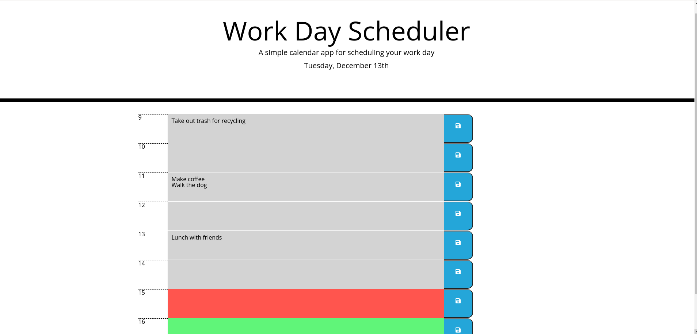

# Daily-Planner

## Description

This is a simple Daily Planner app to plan 9 - 5 activities of a single (present) day.

It is programmed with HTML, CSS, JavaScript, jQuery, momentJS and Font Awesome. It was tested with Google Chrome, no guarantees that it will work with other browsers.

It saves the data to the browser's local storage.

## Usage

Each hour between 9 AM and 5 PM has its own row with a text area that accepts notes like to-do items. 

If the user desires to save the data persistently (i.e. across the browser reloads or restarts), the "Save" button on the corresponding row needs to be clicked.

Clearing the text data in the hour slot is achieved simply by deleting the text area content and clicking the Save button.

## Screenshot

## Installation

Clone the repo and run in the Google Chrome browser by opening the index.html file.

Alternatively you can run it from the [live published version](https://stansaner.github.io/Daily-Planner/) online.

## Licence

MIT License